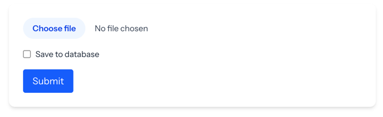

# CSV Analytics

CSV Analytics is a Laravel + React single-page application that parses housing data from a CSV file and optionally saves it to the database. After uploading the file, the app provides insightful statistics including average price, total houses sold, number of crimes in 2011, and the average price per year in the London area.

---

<p align="center">
  
</p>

## CSV Upload Requirements
File format: Only files with the .csv extension are accepted.

CSV structure: The file must contain the following headers in this exact order:
```bash
date,area,average_price,code,houses_sold,no_of_crimes,borough_flag
```

## Tech Stack

- **Backend**: Laravel 12 
- **Frontend**: React 19 
- **CSV Parsing**: [league/csv](https://csv.thephpleague.com/)
- **Database**: MySQL (local development) + SQLite (for testing)
- **Testing**: PHPUnit 

---

## Setup Instructions
```bash
git@github.com:YourUsername/CsvAnalytics.git
```

```bash
cd CsvAnalytics
```

```bash
composer install
```

```bash
npm install
```

```bash
cp .env.example .env
```

```bash
php artisan key:generate
```

Update your .env file with your local MySQL database credentials:

```bash
DB_CONNECTION=mysql
DB_HOST=127.0.0.1
DB_PORT=3306
DB_DATABASE=csvanalytics
DB_USERNAME=root
DB_PASSWORD=
```

Run Migrations

```bash
php artisan migrate
```

Start the App
```bash
php artisan serve
```
```bash
npm run dev
```

## Running Tests


Setup .env.testing file
```bash
cp .env .env.testing
```

Update it for SQLite in-memory database

```bash
DB_CONNECTION=sqlite
DB_DATABASE=:memory:
```

Run the test
```bash
php artisan docs
```


